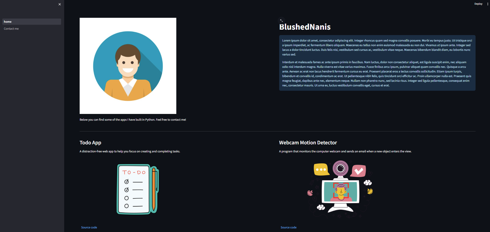
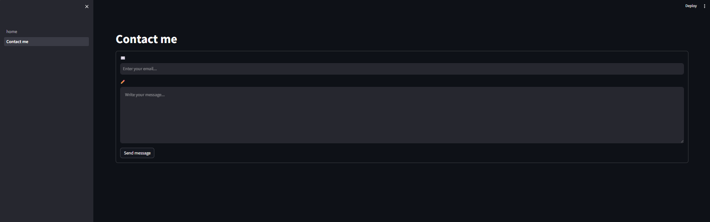

# Showcase Website Streamlit

Showcase website made with streamlit. The website has two pages:

1. Home: Main page with the profile description and the list of projects.
2. Contact Me: Contact page with a form to send an email.

The projects are loaded from a csv file, where you can add your projects in the columns *title, description, url, image*. The url columns are intended to paste the github url to your repository, and the image is the image name. The project images are loaded from the *"images"* folder, which must be in the root directory of the project, and the names must correspond with the ones in the csv file.

### How to use?

* Install requirements.txt
* Create a *.env* file in the root directory of the project and set the following variables:
  * *pypass*: Gmail app password
  * *email*: Gmail address, which will serve as sender and receiver.
* Set your name and description in *Home.py*.
* Set your project details in the .*cvs* file.
* Upload your project images in the *"images"* folder.
* Run with the command *streamlit run main.py*

### Screenshots:

